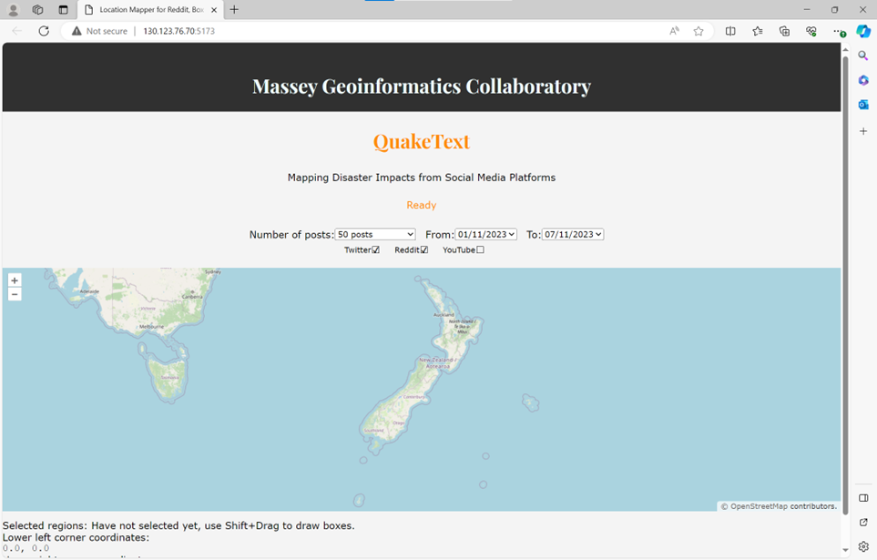

## QuakeText Project

#### Harvesting live contents from social media platforms

The QuakeCoRE-funded research initiative, known as QuakeText, focuses on the development of techniques for automatically extracting and pinpointing disaster effects from social media content.

The explosive expansion of social media has brought about significant changes in society, including increased online social interaction, access to informal participative media, and highly specific advertising, among other things. Nevertheless, the untapped potential of social media in disaster response remains. People frequently provide real-time accounts of disaster events on social media, including information about specific effects like damage to infrastructure, injuries, hazardous situations, and their exact geographical coordinates. Unfortunately, this valuable information's potential for expediting post-disaster recovery and restoration is currently underutilized. Additionally, having real-time access to this data with precise geolocation (latitude and longitude) information could significantly enhance earthquake response and hasten recovery efforts. Current methods are constrained in their ability to identify fine-grained impact details and associate those impacts with specific locations mentioned in the content.

To successfully attain the objectives mentioned above, it is imperative to construct an extensive pipeline encompassing a series of meticulously orchestrated stages. This multifaceted process entails several critical components, which include the following intricately choreographed steps: First and foremost, the initial stage necessitates the meticulous collection of data from various social media platforms. This data is subsequently subjected to a rigorous pre-processing phase, where it undergoes cleansing, organization, and transformation to ensure its suitability for analysis. In the subsequent phase, the focus shifts towards the realm of advanced semantic analysis. Leveraging the formidable capabilities of Natural Language Processing (NLP) and Artificial Intelligence (AI) technologies, the system conducts an in-depth examination of the textual content. This involves discerning intricate nuances, extracting pertinent information, and identifying the geographical context within the text. The utilization of these cutting-edge technologies enhances the system's ability to decipher and contextualize data. Lastly, the culminating step entails the presentation of the meticulously processed results to the end-user via an intuitive and user-friendly interface. This final stage ensures that the insights gleaned from the data are readily accessible and comprehensible, thus facilitating informed decision-making and engagement.

As a pipeline project, I am mainly responsible for the first stage of this project, which is fetching raw social media posts(tweets) from multiple social media platforms and pre-processing them to a preset data format. After storing them on the computer, these files will be used for subsequent steps and finally display the results to user interface. I wrote a web page for users to manually select the raw social media data, wrote the code for fetching data and deployed them to the server “hpc-kstock05.massey.ac.nz:5173” (The IP address is: 130.123.76.70, limited access only among the {0-6} HPCs).

​                               

